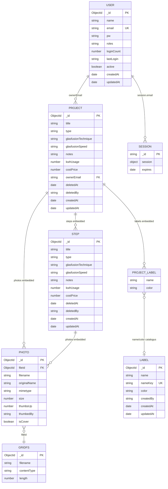

# Database model

MongoDB Atlas-database: **`project-captainjohn`** (via `MONGO_URI`).

Foto-bestanden staan in **GridFS** (`bucketName: photos`). Sessies staan in MongoDB via `connect-mongo` (zelfde cluster, vaak `MONGO_SESSION_URI` of `MONGO_URI`).

Broncode: `server/model/*.model.js`.

---

## Schema



Embedded documenten (`Step`, `Photo`, `PROJECT_LABEL`) zitten in het `projects`-document; `LABEL`, `USER`, GridFS en sessies zijn aparte collections.

---

## Collections

| Collection | Model | Beschrijving |
|---|---|---|
| `users` | `User` | Accounts (argon2-wachtwoord) |
| `projects` | `Project` | Atelierprojecten + stappen + foto-metadata |
| `labels` | `Label` | Gedeelde labelcatalogus (naam + kleur) |
| `photos.files` / `photos.chunks` | GridFS | Binaire foto’s |
| sessie-store | connect-mongo | Express-sessies |

---

## User

```text
User
├── name: String
├── email: String (unique, lowercase)
├── pw: String              # argon2-hash
├── roles: [String]         # o.a. "editor", "admin"
├── loginCount: Number
├── lastLogin: String
├── active: Boolean
├── createdAt / updatedAt
```

Admin-rechten: rol `admin` en/of e-mail gelijk aan `ADMIN_EMAIL` (standaard `john.verberne@gmail.com`).

---

## Project

```text
Project
├── title: String (required)
├── type: enum
│     glasfusion | tiffany | glas-in-lood | hout | keramiek | tassen | overige
├── glasfusionTechnique?: slump | fuse | cast
├── glasfusionSpeed?: fast | medium | slow | ultra-slow
├── notes: String
├── kwhUsage: Number | null
├── costPrice: Number | null
├── sellingPrice: Number | null
├── saleStatus: showroom | te_koop | verkocht | null   # verkoophoekje
├── saleDescription: String                              # tekst voor verkoophoekje
├── ownerEmail: String | null (index)
├── deletedAt: Date | null (index)   # soft-delete
├── deletedBy: String | null
├── labels: [{ name, color }]
├── photos: [Photo]
├── steps: [Step]
├── createdAt / updatedAt
```

Glasfusion: `glasfusionTechnique` en `glasfusionSpeed` zijn verplicht als `type === "glasfusion"`.

### Photo (embedded)

```text
Photo
├── _id
├── fileId: ObjectId        # GridFS file id
├── filename / originalName / mimetype / size
├── url                     # legacy / afgeleid bij serialisatie
├── thumbsUp: Number
├── thumbedBy: [String]     # voter-id's (user:email of anon:uuid)
├── isCover: Boolean        # hoofdfoto op projectkaart (= eerste projectfoto)
```

Maximaal één projectfoto heeft `isCover: true`. Zonder markering valt de UI terug op de eerste foto.

### Step (embedded)

```text
Step
├── _id
├── title: String
├── type / glasfusionTechnique / glasfusionSpeed  # zelfde enums als project
├── notes / kwhUsage / costPrice
├── deletedAt / deletedBy   # soft-delete
├── photos: [Photo]
├── createdAt / updatedAt
```

---

## Label (catalogus)

```text
Label
├── name: String
├── nameKey: String (unique, lowercase)  # voor deduplicatie
├── color: String                         # hex, bijv. #b85c38
├── createdBy: String | null
├── createdAt / updatedAt
```

Labels op een project zijn een kopie `{ name, color }`. Bij opslaan wordt de catalogus geüpdatet (upsert op `nameKey`).

---

## Soft-delete

| Entiteit | Soft-delete | Definitief |
|---|---|---|
| Project | `deletedAt` / `deletedBy` | GridFS-foto’s + document weg |
| Stap | `deletedAt` / `deletedBy` op step | Stap + stapfoto’s weg |

Publieke API toont geen soft-deleted projecten of stappen. Eigenaar/admin ziet prullenbak in de bewerk-UI.
